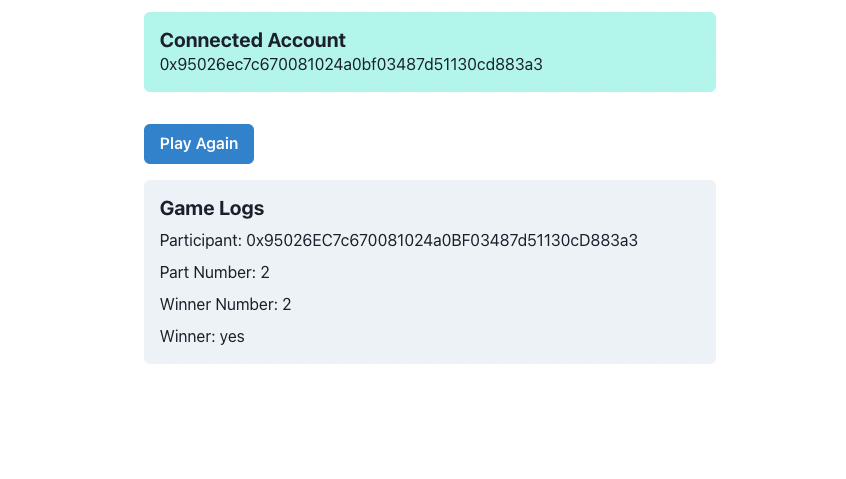

# Exercise
In this exercise we are creating a small Web3 App. The app will connect to a Web3 wallet (MetaMask) and then allow the user to play a small game that lives on the Blockchain.

## How to start
1. Go to [Metamask](https://metamask.io/download/) with your browser of choice and install it.
2. Once installed, create a new wallet.
3. Copy your Wallet Address, head over to [this website](https://faucet.moonbeam.network/) and enter your address. This will give you some test tokens.

4. create a new branch for your project and publish the branch
5. `npm install` to install dependecies `npm run start` to start the app
6. Start programming

## Your tasks
The project already has the base for this setup and its your task to:
1. Figure out how to call a Smart Contract
2. Call the provided Smart Contract `playGame()` and wait for the response
3. Listen to the event `Participated`
4. Display the Results in a Log
5. Make the App look presentable with the UI Library of your choice

In its most simple form your Result could look something like [this](https://moonbase-example-app.vercel.app/):

## Additional Information
- This is the [contract](https://moonbase.moonscan.io/address/0xdCec1904de0D88670Cf67ed4b5E6d0c347947B81#code) we want to call, you can find the ABI and the contract Address there and also already in the App
- The ABI is needed for your App to know what the functions of the Contract want as inputs and what they will return
- We are using the web3 and ethers packages